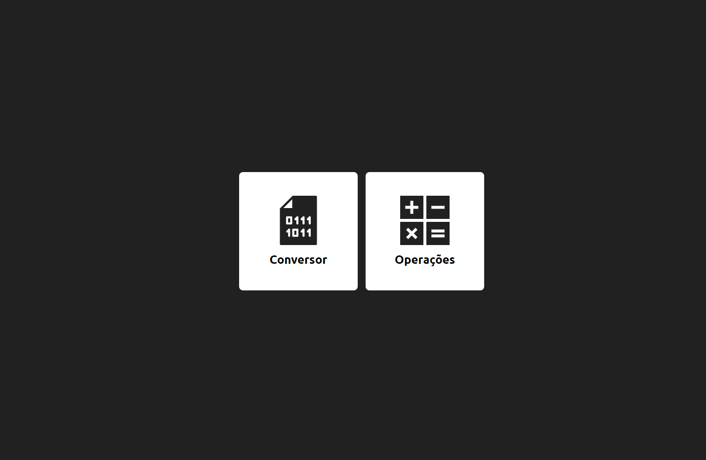

# Bin2Dec
Este projeto surgiu com a falta de vontade em estudar o conceito de bases númericas ensinado pela faculdade. 

Nada melhor que aprender construindo algo, e para tanto, imaginei o Bin2Dec. Ele é capaz de converter números que estão em bases numéricas diferentes e realizar operações aritméticas. 

## :hammer: Instalação
```bash
# Clone este repositório
$ git clone https://github.com/rbmelolima/Bin2Dec

# Entre na pasta raiz
$ cd Bin2Dec

# Abra o index.html
```


